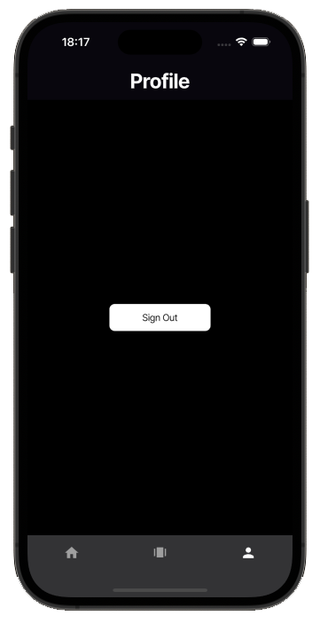

# Tinder for Movies

## Overview

Tinder for Movies is a **Flutter** application that allows users to discover movies in an engaging, Tinder-like experience. Users can swipe right to add movies to their favorites or swipe left to skip them. The app features **Firebase Authentication** for secure login and logout, and stores user preferences in **Firestore**. The interface includes a horizontally scrollable movie list organized by categories (All, My List, Drama, Action), and a swipe interface to quickly interact with movie suggestions.

## Screenshots

  
  
  

## Features

- **Firebase Authentication**: Secure login/logout experience.
- **Bottom Navigation Menu**: Easy navigation between pages.
- **Movie List**:
    - Horizontally scrollable sections:
        - All Movies
        - My List
        - Drama
        - Action
- **Tinder-like Movie Swiping**:
    - **Swipe Right / Thumbs Up** → Add to Favorites.
    - **Swipe Left / Thumbs Down** → Skip movie.
- **Profile View**:
    - Simple view with logout functionality.
- **Widgetbook Integration**:
    - Streamlined development and testing of UI components.

## Technologies Used

- **Flutter** – Cross-platform UI toolkit
- **Dart** – Programming language
- **Firebase Auth** – Secure user authentication
- **Cloud Firestore** – Real-time cloud-hosted NoSQL database
- **Widgetbook** – Visualize and test widgets in isolation

