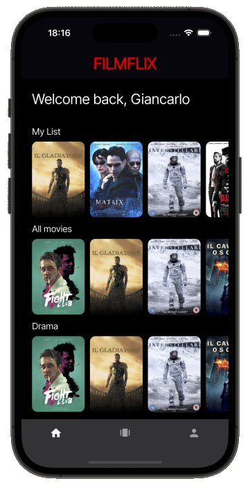

# Tinder for Movies

## Overview

**Tinder for Movies** is a Flutter application that allows users to discover movies in an engaging, Tinder-like experience. Users can swipe right to add movies to their favorites or swipe left to skip them. The app features Firebase Authentication for secure login and logout, and stores user preferences in Firestore. The interface includes a horizontally scrollable movie list organized by categories (All, Favourites, Drama, Action), and a swipe interface to quickly interact with movie suggestions.

Built with clean UI design principles, modular architecture, and **Widgetbook** for component testing, this app is a great example of scalable Flutter development integrated with real-time backend services.

## Screenshots

  
  

## Features

- **Firebase Authentication**: Secure login/logout experience.
- **Bottom Navigation Menu**: Easy navigation between Movies and Profile views.
- **Movie List**:
    - Horizontally scrollable sections:
        - All Movies
        - My List
        - Drama
        - Action
- **Tinder-like Movie Swiping**:
    - **Swipe Right / Thumbs Up** → Add to Favorites.
    - **Swipe Left / Thumbs Down** → Skip movie.
- **Profile View**:
    - Displays basic user information.
    - Logout functionality.
- **Widgetbook Integration**:
    - Streamlined development and testing of UI components.

## App Architecture

The app is designed with clean separation of concerns using service-based logic:

### 1. Authentication and User Management
- Handled using Firebase Authentication.
- Auth state changes reflect instantly in the UI.

### 2. Firestore Integration
- Movie preferences (favorites) are saved per user.
- Firestore is queried and filtered by genre/category in real time.

### 3. Navigation
- Bottom navigation bar manages view switching between movies list, tinder-Like swipe screen and profile/logout.

### 4. Tinder-Like Swipe Interface
- Custom swipe widgets to interact with movies.
- Integrated animations and gesture detection.

## Technologies Used

- **Flutter** – Cross-platform UI toolkit
- **Dart** – Programming language
- **Firebase Auth** – Secure user authentication
- **Cloud Firestore** – Real-time cloud-hosted NoSQL database
- **Widgetbook** – Visualize and test widgets in isolation

